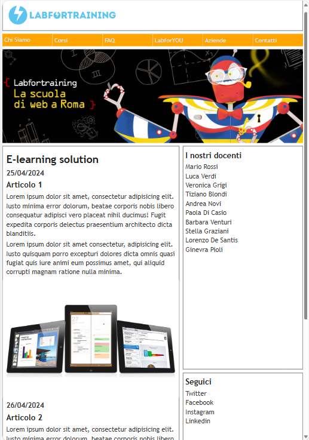
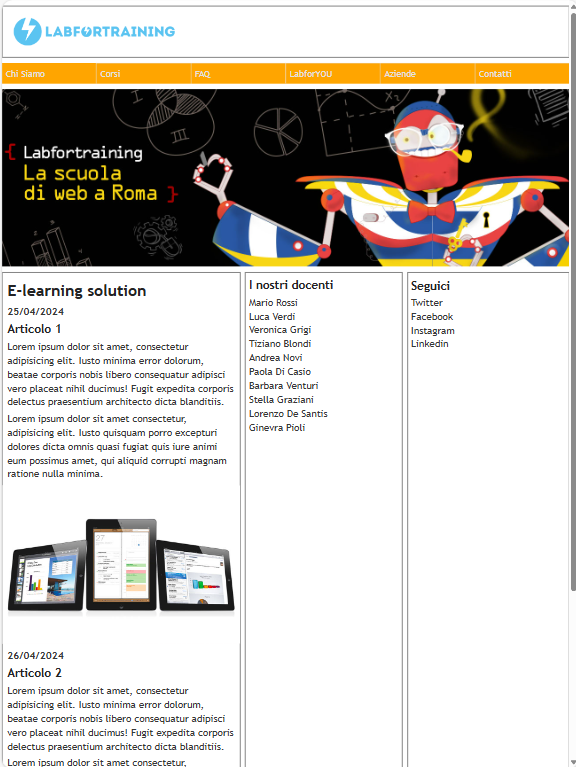
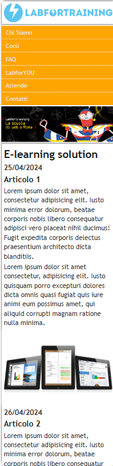

🇮🇹 ITALIAN: Esercizio di fine modulo del corso di Responsive web design. E' formato solo da un file HTML e un file CSS.

📄 HTML: Sito single-page con un div unico che contiene i 3 macro-contenitori con cui e' stato diviso il sito: Header(formato da logo, e sotto di esso navbar e hero banner), Main (2 articoli, una section e un 
asidecon al suo interno i "link" dei social media) e un Footer( con due sezioni, la prima contenente le icone e sotto di esso un div con copyright).

✏️ SASS: Uso del preprocessore SASS. Questo e' stato il mio primo progetto con SASS quindi mi sono limitata all'uso delle variabili e dell'import in diversi file SCSS dentro la cartella partial (tutto pubblicato 
con questo progetto).

💻CSS: Approccio Mobile-first. Importante e' stato l'uso di display flex e display grid per fare gli allineamenti di tutta la pagina e il loro ridimensionamento con le mediaQueries. Uso della tecnica CSS Sprite 
per le icone nel footer.

🇬🇧 ENGLISH: Last exercise of the Responsive web design course. It consists only of an HTML file and a CSS file.

📄 HTML: Single-page website with a div that contains the 3 main containers that are dividing the page: the Header container (logo and below it a navbar and a hero banner), the Main container (2 articles, 
with a section and an aside that contains the social media "links") and at the bottom of the page the Footer contains (with two sections, the first with the icons and below it divs with the copyright).

✏️ SASS: The design is made with the SASS preprocessor. This was my first project with SASS so I have used only the variables and the import of the different SCSS files inside the partial folder (all published 
inside this project).

💻CSS: The page is made with the Mobile-first approach. It is important the use of flex displays and grid displays to make the alignments of the whole page and their resizing with the mediaQueries. Using the CSS 
Sprite for the icons in the footer.

